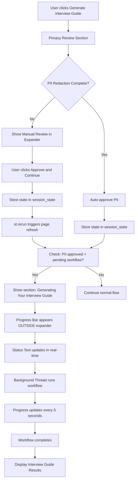

# Interview Preparation Progress Flow Design

[← Back to Design Documents](README.md)

## Overview

This document describes the design and implementation of the progress update system for the Interview Preparation feature in the Job Search Assistant. The system provides real-time feedback to users during the interview guide generation workflow, ensuring a smooth and transparent user experience.

## Problem Statement

### Initial Issue
The original implementation showed a static spinner with the message "🔍 Processing your information..." while the workflow executed. This caused several UX problems:

1. **No Progress Indication**: Users had no visibility into workflow progress or current step
2. **Static Display**: The message remained unchanged throughout the entire process
3. **UI Blocking**: Progress updates appeared inside collapsible expanders, requiring manual expansion to view

### Requirements
- Real-time progress updates during workflow execution
- Clear visual feedback about current workflow step
- Progress indicators visible outside any collapsible UI elements
- Smooth transition from PII review to workflow execution

## Solution Architecture

### Flow Design

The solution uses a **session state-driven approach** that separates PII approval from workflow execution, allowing progress updates to display prominently outside any expander contexts.



### Key Components

#### 1. Session State Management
```python
# Session state variables for flow control
if "pii_approved" not in st.session_state:
    st.session_state.pii_approved = False
if "pending_workflow_state" not in st.session_state:
    st.session_state.pending_workflow_state = None
```

#### 2. Two-Phase Execution
- **Phase 1**: PII review and approval within expander
- **Phase 2**: Workflow execution outside expander context

#### 3. Threading-Based Progress Updates
```python
# Progress steps with visual indicators
progress_steps = [
    (10, "🔒 Validating and redacting personal information..."),
    (25, "🔍 Researching company and role..."),
    (50, "❓ Generating interview questions..."),
    (75, "💡 Creating personalized answers..."),
    (90, "📋 Compiling your interview guide..."),
    (100, "✅ Finalizing your interview guide...")
]
```

## Implementation Details

### PII Approval Flow
1. User submits interview details
2. PII redaction occurs automatically
3. If manual review needed: expander shows redacted resume
4. On approval: state stored, page refreshes via `st.rerun()`
5. If auto-approved: workflow proceeds immediately

### Progress Display System
1. **ThreadPoolExecutor** runs workflow in background thread
2. **Main UI thread** updates progress indicators every 0.5 seconds
3. **Progress bar** shows completion percentage (0-100%)
4. **Status text** shows current workflow step with emojis
5. **Visual separation** with header "🚀 Generating Your Interview Guide"

### Error Handling
- Thread exceptions captured and re-raised in main thread
- Progress indicators cleared on errors
- Meaningful error messages displayed to user
- Session state reset on failures

## Benefits

### User Experience
- ✅ **Real-time Feedback**: Users see exactly what's happening
- ✅ **Visual Clarity**: Progress appears prominently outside expanders
- ✅ **Professional Feel**: Smooth transitions with clear steps
- ✅ **Error Transparency**: Clear error messages when issues occur

### Technical Benefits
- ✅ **Non-blocking UI**: Background threading prevents UI freezing
- ✅ **State Management**: Clean separation of concerns via session state
- ✅ **Maintainable Code**: Clear flow logic easy to extend/modify
- ✅ **Robust Error Handling**: Graceful failure recovery

## Configuration

### Progress Steps
Progress steps can be customized by modifying the `progress_steps` array:

```python
progress_steps = [
    (percentage, "🔥 Custom step message..."),
    # Add more steps as needed
]
```

### Timing
- **Progress Update Interval**: 0.5 seconds per check
- **Step Duration**: ~5 seconds per step (adjustable)
- **Completion Pause**: 0.5 seconds before cleanup

## Future Enhancements

### Potential Improvements
1. **Dynamic Step Calculation**: Base progress on actual workflow completion
2. **Estimated Time Remaining**: Show time estimates for each step
3. **Cancel Functionality**: Allow users to cancel in-progress workflows
4. **Progress Persistence**: Save/restore progress across page refreshes
5. **WebSocket Updates**: Real-time updates from workflow execution

### Workflow Integration
The progress system is designed to integrate with any LangGraph workflow by:
1. Adding progress checkpoints in workflow nodes
2. Using callback mechanisms to report step completion
3. Implementing workflow state monitoring

## Related Documentation

- [Agent Infrastructure](agent-infrastructure.md) - LangGraph workflow system
- [Observability & Tracing](observability-tracing.md) - Monitoring workflow execution
- [Configuration Management](configuration.md) - UI configuration options

---

**Last Updated**: December 2024
**Implementation**: `ui/pages/interview_prep.py`
**Related Files**: `src/agent/workflows/interview_prep/main.py`
